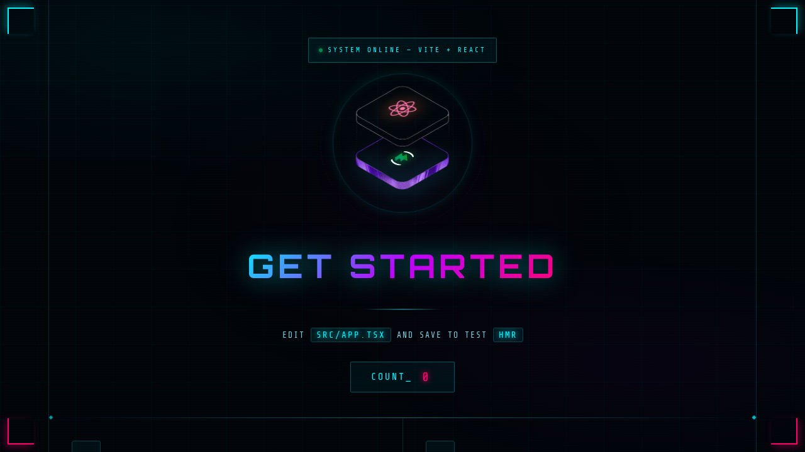

# X-Template V.0.0.0-Genesis

> Cyberpunk Glassmorphism starter template — React + TypeScript + Vite

[](https://github.com/Ex2-Axon/x-template/actions/workflows/deploy.yml)
[](https://bsky.app/profile/microtronic.bsky.social)

**Live demo:** https://ex2-axon.github.io/x-template/



---

## Stack

| | |
|---|---|
| **Framework** | React 19 + TypeScript |
| **Build tool** | Vite 8 |
| **Styling** | CSS (Glassmorphism + Neon) + Tailwind CSS 4 |
| **Package manager** | pnpm |
| **Deploy** | GitHub Pages (auto on push) |

---

## Features

- Cyberpunk glassmorphism UI with full animation
- Neon glow effects — cyan, pink, purple, green
- Animated grid background + floating particles
- Glitch text effect on title
- Scanline CRT overlay
- Orbit rings on hero image
- Staggered entrance animations
- Auto-deploy to GitHub Pages on push
- Auto-post to Discord, Bluesky, X on push

---

## Getting Started

```bash
# Install dependencies
pnpm install

# Start dev server
pnpm dev

# Build for production
pnpm build

# Preview production build
pnpm preview
```

---

## GitHub Actions Workflows

| Workflow | Trigger | Description |
|---|---|---|
| `deploy.yml` | push to main | Build & deploy to GitHub Pages |
| `discord-notify.yml` | push to main | Send release embed to Discord |
| `bluesky-notify.yml` | push to main | Post release to Bluesky |
| `x-notify.yml` | push to main | Post release to X (Twitter) |

### Required Secrets

Go to **Settings → Secrets and variables → Actions** and add:

| Secret | Description |
|---|---|
| `DISCORD_WEBHOOK_URL` | Discord webhook URL |
| `BSKY_IDENTIFIER` | Bluesky handle (e.g. `microtronic.bsky.social`) |
| `BSKY_APP_PASSWORD` | Bluesky app password |
| `X_API_KEY` | X Consumer Key |
| `X_API_SECRET` | X Consumer Secret |
| `X_ACCESS_TOKEN` | X Access Token |
| `X_ACCESS_TOKEN_SECRET` | X Access Token Secret |

---

## Project Structure

```
x-template/
├── .github/
│   └── workflows/
│       ├── deploy.yml
│       ├── discord-notify.yml
│       ├── bluesky-notify.yml
│       └── x-notify.yml
├── public/
│   ├── favicon.svg
│   └── icons.svg
├── src/
│   ├── assets/
│   ├── App.tsx
│   ├── App.css
│   ├── index.css
│   └── main.tsx
├── package.json
└── vite.config.ts
```

---

## Connect

- Bluesky: [@microtronic.bsky.social](https://bsky.app/profile/microtronic.bsky.social)
- Discord: [Join server](https://discord.gg/8Zeq8VCU)
- GitHub: [Ex2-Axon](https://github.com/Ex2-Axon)

## Generation Prompt
```text
You are building a daily UI project. Below is the theme specification for today.

## Theme Context (daily-context.json)
```json
{
  "day": 32,
  "date": "2026-05-30",
  "version": "1.32.0",
  "project_name": "x-template-032",
  "theme": {
    "name": "Aurora Borealis",
    "style": "aurora-borealis",
    "mood": "ethereal, colorful, dreamy, natural"
  },
  "palette": {
    "background": "#020b18",
    "surface": "#041525",
    "primary": "#00ff88",
    "accent": "#7c3aed",
    "text": "#e0f7fa",
    "muted": "#1a3a4a"
  },
  "typography": {
    "heading": "Exo 2",
    "body": "Exo 2",
    "size": "large"
  },
  "layout": {
    "structure": "centered",
    "density": "spacious",
    "border_style": "aurora gradient"
  },
  "animation": {
    "level": "high",
    "style": "aurora wave, particle drift"
  },
  "components": {
    "hero_text": "AURORA",
    "subtitle": "Light from the north.",
    "button_label": "GLOW_",
    "badge_text": "NORTHERN LIGHTS"
  },
  "commit_message": "feat: UI Day 32 — Aurora Borealis [fallback]",
  "source": "fallback",
  "selected_component": {
    "category": "Buttons",
    "component": "TISEPSE_young-lionfish-81.html",
    "path": "C:\\Users\\User\\Documents\\GitHub\\Axon\\x-components\\Buttons\\TISEPSE_young-lionfish-81.html",
    "content": "<button class=\"button\"><span></span>Bouton</button>\n\n<style>\n/* Tags: material design, button, active */\n.button {\n  background-color: #ff9b82;\n  cursor: pointer;\n  padding: 1em;\n  width: 10rem;\n  font-size: 17px;\n  box-shadow: 0 0.4rem #ffc8c8;\n  border-radius: 27px;\n  overflow: hidden;\n  z-index: 2;\n  transition: 0.2s;\n  border: 2px solid black;\n}\n\n.button:hover {\n  transform: translateY(0.2rem);\n  box-shadow: 0 0.25rem #ffc8c8;\n  letter-spacing: 2px;\n  color: #fefefe;\n}\n\n.button:active {\n  transform: translateY(0.6rem);\n  box-shadow: none;\n  transition: 0.1s;\n}\n\n.button span {\n  background: #e48586;\n  border-radius: 27px;\n  height: 100%;\n  width: 0%;\n  position: absolute;\n  left: 0;\n  bottom: 0;\n  z-index: -1;\n  transition: 0.2s ease-in-out;\n}\n\n.button:hover span {\n  width: 100%;\n}\n\n</style>"
  }
}
```

## Selected Component Reference
- Category: Buttons
- Component: TISEPSE_young-lionfish-81.html
- Path: C:\Users\User\Documents\GitHub\Axon\x-components\Buttons\TISEPSE_young-lionfish-81.html

Use the selected component HTML below as the primary design reference for the new UI. Keep the structure and styling assumptions in mind while rewriting the requested files.
```html
<button class="button"><span></span>Bouton</button>

<style>
/* Tags: material design, button, active */
.button {
  background-color: #ff9b82;
  cursor: pointer;
  padding: 1em;
  width: 10rem;
  font-size: 17px;
  box-shadow: 0 0.4rem #ffc8c8;
  border-radius: 27px;
  overflow: hidden;
  z-index: 2;
  transition: 0.2s;
  border: 2px solid black;
}

.button:hover {
  transform: translateY(0.2rem);
  box-shadow: 0 0.25rem #ffc8c8;
  letter-spacing: 2px;
  color: #fefefe;
}

.button:active {
  transform: translateY(0.6rem);
  box-shadow: none;
  transition: 0.1s;
}

.button span {
  background: #e48586;
  border-radius: 27px;
  height: 100%;
  width: 0%;
  position: absolute;
  left: 0;
  bottom: 0;
  z-index: -1;
  transition: 0.2s ease-in-out;
}

.button:hover span {
  width: 100%;
}

</style>
```

## Your Task
Completely redesign the UI by rewriting these three files from scratch:
- `src/App.tsx`
- `src/App.css`
- `src/index.css`

## Rules for App.tsx
1. Keep ALL existing imports:
   - `import { useState, useEffect, useRef } from 'react'`
   - `import reactLogo from './assets/react.svg'`
   - `import viteLogo from './assets/vite.svg'`
   - `import heroImg from './assets/hero.png'`
   - `import './App.css'`
2. Keep the `CounterNum` component (useRef + useEffect animation)
3. Keep the counter button with `onClick` / `setCount` handler
4. Keep the Documentation section (Vite/React links)
5. Keep the Social section (GitHub/Discord/X/Bluesky links + SVG icons)
6. Do NOT use CSS custom properties (`--var-name`) in inline `style` attributes — TypeScript will error

## Rules for CSS
- Apply the palette, typography, layout structure, animation level, and component text from the JSON above
- Use Google Fonts via `@import` in `index.css`
- Match the theme mood: ethereal, colorful, dreamy, natural

## Mandatory Requirements (apply to every build)

### 1. Responsive — Mobile First
- Design for mobile (320px) first, scale up with `min-width` breakpoints
- Touch targets minimum 44×44px
- No horizontal scroll on any screen size
- Fluid typography: use `clamp()` or responsive units (`rem`, `%`, `vw`)
- Images and layout must reflow gracefully at 320px, 768px, 1280px

### 2. Footer Copyright
- The page MUST have a `<footer>` at the bottom
- Footer text: `© 2026 Microtronic. All rights reserved.`
- Style the footer to match the theme palette (muted text on surface background)

### 3. SEO Standards
- `index.html` must have a descriptive `<title>`: `AURORA — Aurora Borealis | Microtronic`
- Add `<meta name="description">` with the subtitle: `Light from the north.`
- Add `<meta name="keywords">` relevant to the theme
- Add Open Graph tags: `og:title`, `og:description`, `og:type` (website)
- All images must have meaningful `alt` attributes
- Use semantic HTML: `<header>`, `<main>`, `<section>`, `<footer>`, `<nav>` where appropriate
- Heading hierarchy: one `<h1>` (hero), `<h2>` for sections — no skipping levels

## After saving all files
1. Update `version` in `package.json` to `1.32.0`
2. Update `<title>` and meta tags in `index.html` as specified above
3. Run: `pnpm build`
4. If build succeeds → write `done` to `scripts/build-done.flag`
5. If build fails with TypeScript errors → fix them and rebuild

```
